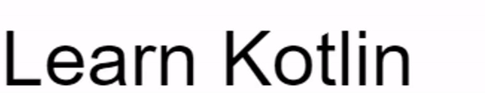

# TypedText
A Typescript library for creating typing word effect on the browser for a given set of words

## What is typing word effect?
* A picture is a thousand words, this is what the library does

* As we can see the name of the languages in the above example seem to be typed/untyped, this is the crux of the library.
* This part is the dynamic part of the text
* There's also the static part which in this case is "Learn"

## Can it be styled?
* Yes, TypedText injects 3 elements span.static-text, span.dynamic-text and div.cursor to the given container element.
* Using the selectors mentioned above we can add/change CSS properties.

# Completed Work
* The library is self contained, doesn't have any dependencies.

## TODO
* Need to find a math formula to calculate the size of the cursor with respect tot the font size of the typed text
